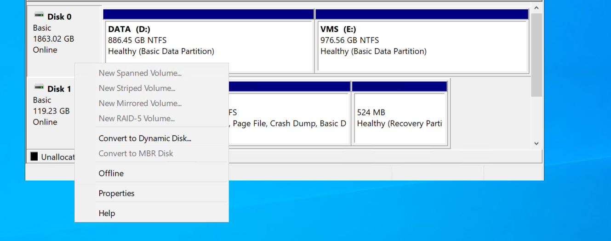
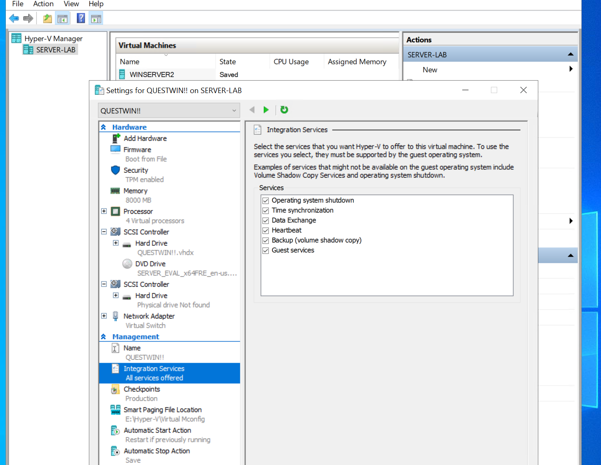
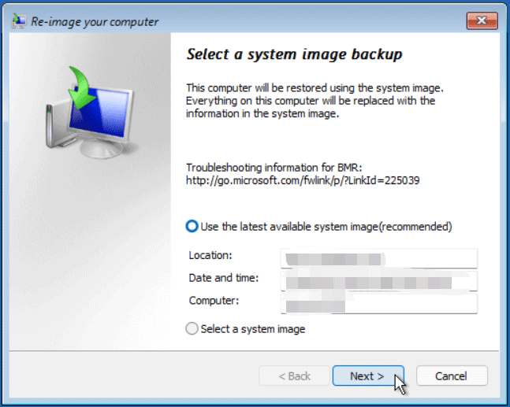
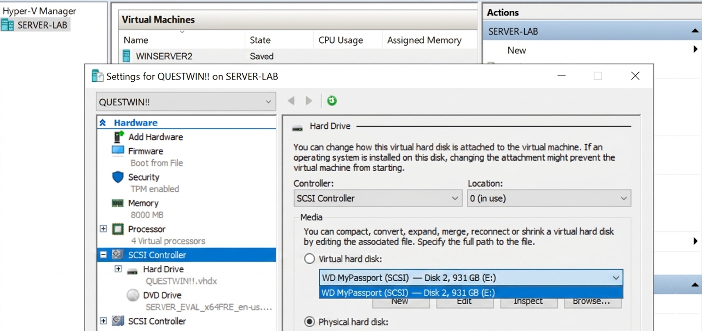
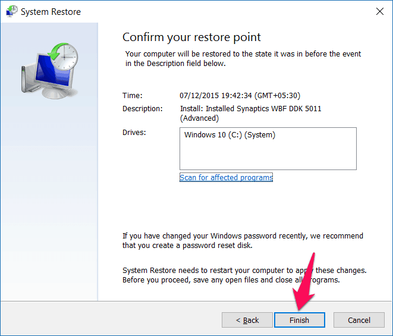

# 🛠️ DC Cross-Site Restore — Hyper-V (External)

This guide documents the successful cross-site disaster-recovery exercise: restoring the `questlab.local` domain controller (**SERVER-QUEST**) onto a remote Hyper-V host using a physical drive passthrough.

**Status:** ✅ Restore completed  
**Source DC:** SERVER-QUEST (`questlab.local`)  
**Backup Carrier:** WD MyPassport (NTFS, 931 GB)  
**Target VM:** Gen 2 VM (UEFI) - Windows Server 2022  

---

## 🖥️ Phase 1: Hyper-V VM & Disk Passthrough Setup
Before the restoration can begin, the physical hardware must be prepared and "passed through" to the virtual environment.

### 1. Set Host Disk to Offline
In the Windows Host's **Disk Management**, the WD MyPassport must be set to **Offline**. Hyper-V cannot claim a physical disk if the Host OS is currently mounting it.

*Figure 1: Setting the backup carrier to 'Offline' state on the host.*

### 2. Configure VM Passthrough
In the **Hyper-V Manager** settings for the new Gen 2 VM:
1. Navigate to **SCSI Controller** > **Hard Drive** > **Add**.
2. Select the **Physical hard disk** radio button.
3. Choose the WD MyPassport from the dropdown.

*Figure 2: Mapping the physical drive directly to the VM's SCSI controller.*

---

## 🏁 Phase 2: Boot & Environment Setup
Boot the VM from the Windows Server 2022 ISO and enter the recovery tools:

1. Select **Repair your computer** > **Troubleshoot** > **System Image Recovery**.

*Figure 3: Accessing the Windows Recovery Environment (WinRE) wizard.*

## 💾 Phase 3: Image Selection
The wizard scans the passthrough disk and identifies the `WindowsImageBackup` folder.

*Figure 4: Identifying the 2026-04-26 backup on the passthrough disk.*

## ⚠️ Phase 4: Critical Disk Exclusion
**Warning:** You must manually exclude your backup drive so the restore process doesn't attempt to format it during the drive layout phase.

*Figure 5: Ensuring the WD MyPassport is excluded from the restoration target.*

## 🔄 Phase 5: Restoration Progress
The system begins "Re-imaging your computer," overwriting the target VHDX with the backed-up data from the physical drive.

*Figure 6: Active restoration of the system volumes.*

## ✅ Phase 6: Finalization & Success
The process is complete when the success dialog appears. The VM is now ready for an isolated first boot.

*Figure 7: Successful Bare Metal Recovery verification.*

---

## 📝 Key Lessons Learned
* **Offline Requirement:** A disk *must* be offline in Disk Management for Hyper-V to see it as a passthrough option.
* **Network Isolation:** On the first boot post-restore, the network adapter **must stay disconnected** to avoid AD metadata corruption.
* **Firmware Consistency:** Gen 2 (UEFI) is mandatory for modern Windows Server restores.

---
*Maintained by blackapple805 | April 2026*