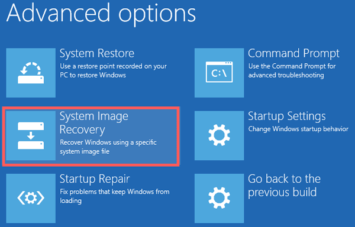
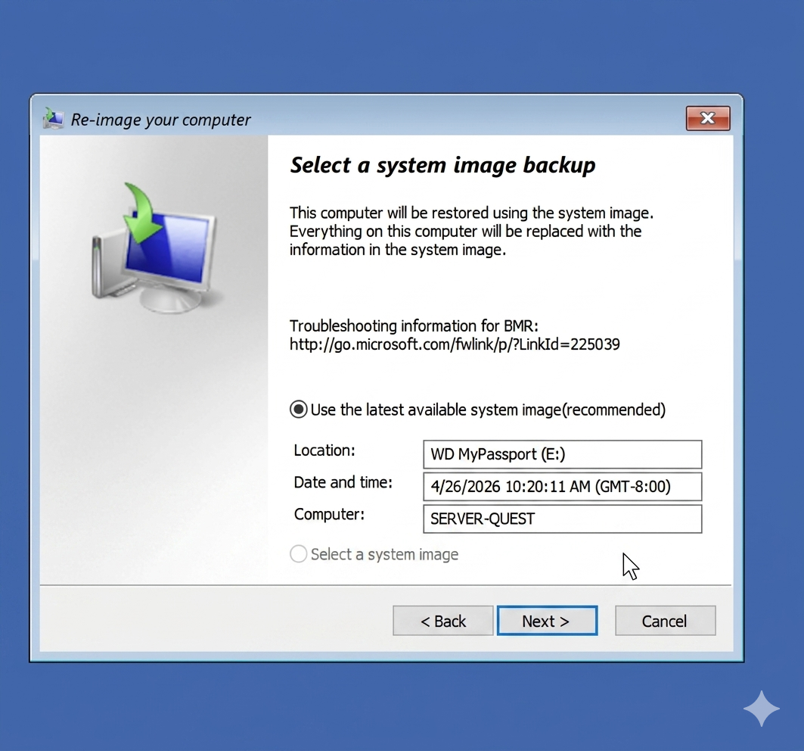

# Technical Report: Cross-Site Domain Controller Restoration

**Project:** Disaster Recovery Validation — SERVER-QUEST  
**Environment:** Physical-to-Virtual (P2V) via Hyper-V Passthrough  
**Status:** ✅ Restore Validated  

---

### Executive Summary
This document confirms the successful cross-site restoration of the `questlab.local` Domain Controller (**SERVER-QUEST**). The exercise validated the use of bare-metal system images for rapid recovery onto disparate hardware using Hyper-V’s physical disk passthrough capabilities.

**Recovery Specifications:**
* **Target OS:** Windows Server 2022 (Standard)
* **Firmware:** Generation 2 (UEFI)
* **Storage Interface:** SCSI Passthrough (WD MyPassport 931 GB)
* **Total Data Volume:** ~75 GB
* **Total Restore Time:** 45 Minutes

---

### Phase 1: Hyper-V Infrastructure Configuration
Restoration begins with preparing the virtual environment to interact directly with the physical backup media.

**1.1 Host Storage Preparation**
The physical backup carrier must be set to an **Offline** state within the host's Disk Management utility. This allows the Hyper-V hypervisor to grant the guest VM exclusive access to the raw disk.

*Figure 1: Transitioning the backup volume to 'Offline' on the host system.*

**1.2 SCSI Controller Mapping**
Within Hyper-V Manager, the physical drive is mapped to the VM's SCSI controller. This bypasses virtual disk overhead and allows the Windows Recovery Environment (WinRE) to read the `WindowsImageBackup` folder natively.

*Figure 2: Configuring physical hard disk passthrough on the target VM.*

---

### Phase 2: Recovery Environment & Image Initialization
The VM is initialized via the Windows Server 2022 ISO to access the Advanced Troubleshooting toolset.

**2.1 System Image Recovery Execution**
The "System Image Recovery" tool is utilized to scan the attached SCSI storage for available backup sets.

*Figure 3: Initializing the System Image Recovery wizard within WinRE.*

**2.2 Volume Verification**
The wizard successfully identified the system image from **2026-04-26** located on the passthrough volume.

*Figure 4: Automated identification of the backup catalog.*

---

### Phase 3: Operational Safeguards
To ensure data integrity, the backup carrier must be excluded from the restoration target list.

**3.1 Disk Exclusion Protocol**
Manual exclusion of the source disk is mandatory to prevent the restoration engine from attempting to partition or format the backup carrier during the drive layout phase.

*Figure 5: Operational advisory: Excluding the WD MyPassport from formatting.*

---

### Phase 4: Restoration & Validation
The engine re-images the virtual hard disk (VHDX) to match the state of the original bare-metal server.

**4.1 Data Restoration Progress**
The process overwrites the target VHDX with the backed-up data from the physical drive.

*Figure 6: Active volume restoration in progress.*

**4.2 Final Success Verification**
Restoration concluded with zero errors. The system is prepared for isolated post-recovery configuration and stabilization.

*Figure 7: Final confirmation of successful Bare Metal Recovery.*

---

### Technical Observations & Best Practices
* **Storage Logic:** Setting the host disk to 'Offline' is the primary prerequisite for successful passthrough mounting.
* **Network Containment:** Post-restoration, the virtual NIC must remain disconnected until AD metadata can be verified to prevent replication conflicts.
* **Firmware Alignment:** Matching the source's UEFI firmware via a Generation 2 VM is critical for bootloader compatibility.

---
**Authored By:** blackapple805  
**Dated:** April 2026