# Connecting OPNsense to an Existing Router/AP on Proxmox

How I added an **OPNsense firewall VM** in front of my homelab while keeping my home router as the WAN gateway and Wi-Fi access point.

> All IPs use placeholders like `10.0.0.x`. Substitute your own.

---

## Goal

Insert OPNsense between the homelab and the router so:

- The **router** stays as upstream gateway and Wi-Fi AP
- **OPNsense** handles firewalling and DNS for the lab
- The **DC** keeps doing AD DS, DNS, and DHCP for domain clients

---

## Prereqs

- Proxmox host with **two physical NICs** (onboard + USB ethernet)
- Existing home router / AP
- OPNsense ISO (checksum-verified)
- DC VM already running

> Two physical NICs is the clean path. Single-NIC + VLANs works but needs a managed switch and is fragile.

---

## Step 1 — Proxmox Bridges

Each OPNsense NIC needs its own bridge tied to a separate physical NIC.

| Bridge  | Physical NIC     | Role |
|---------|------------------|------|
| `vmbr0` | Onboard ethernet | LAN (homelab) |
| `vmbr1` | USB ethernet     | WAN (to router) |

If `vmbr1` doesn't exist: **Datacenter → Node → Network → Create → Linux Bridge**, attach second NIC, apply.

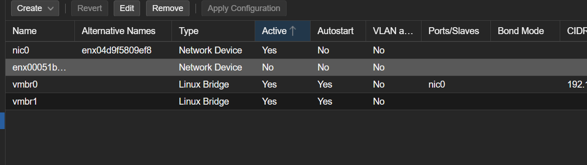

---

## Step 2 — Cable It

```
[ ISP modem ] → [ Router/AP ] ── Wi-Fi to phones, laptops
                     │ LAN port
                     ▼
              USB NIC on Proxmox (OPNsense WAN, vmbr1)

              Onboard NIC on Proxmox (LAN, vmbr0)
                     │
                     ▼
              Homelab VMs (DC, Win11, etc.)
```

The USB NIC plugs into a **LAN port** on the router. That gives OPNsense's WAN a DHCP lease from upstream.

---

## Step 3 — Create the OPNsense VM

| Tab     | Setting |
|---------|---------|
| OS      | OPNsense ISO, Type: Other |
| Disks   | 32 GB, VirtIO SCSI |
| CPU     | 2 cores, type `host` |
| Memory  | 2048 MB (4096 if running Suricata) |
| Network | Bridge `vmbr1`, Model VirtIO, Firewall **unchecked** |

Then add a second NIC (Hardware → Add → Network Device): bridge `vmbr0`, VirtIO, Firewall **unchecked**.

End state:

| VM NIC | Bridge  | Becomes |
|--------|---------|---------|
| `net0` | `vmbr1` | WAN (`vtnet1`) |
| `net1` | `vmbr0` | LAN (`vtnet0`) |

> Always uncheck Proxmox's per-VM Firewall box on OPNsense NICs — it silently breaks OPNsense's own filtering.

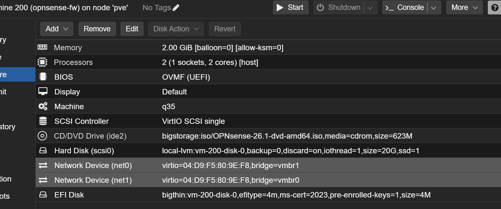

Before first boot, make sure the ISO is set as the primary boot device:

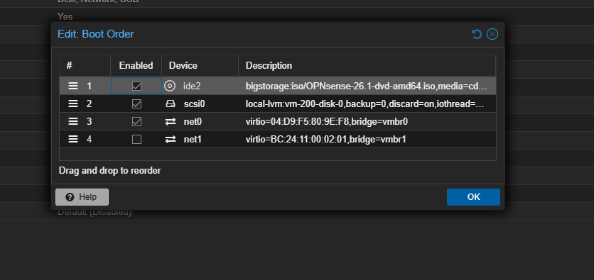

---

## Step 4 — Install OPNsense

Boot, install (I used ZFS), reboot, remove ISO. At the console, verify interface assignment:

- `vtnet0` → LAN (`vmbr0`)
- `vtnet1` → WAN (`vmbr1`)

If flipped, use option **`1) Assign Interfaces`** to swap. Getting this wrong is the #1 reason the web UI is unreachable.

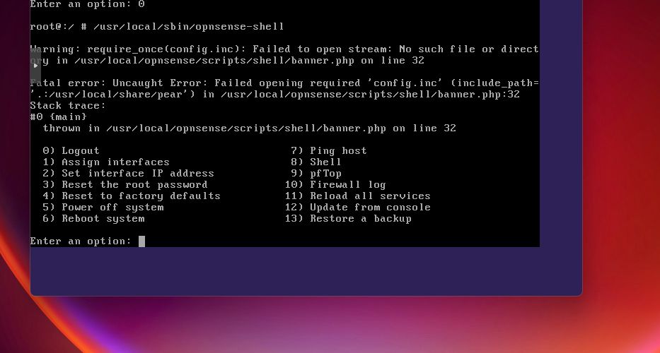

---

## Step 5 — Configure Interfaces

**LAN (`vtnet0`):** static IP, e.g., `10.0.1.1/24`
**WAN (`vtnet1`):** DHCP — pulls a lease from the upstream router

Browse to `https://<LAN-IP>` from a machine on `vmbr0`. Default: `root` / `opnsense`.

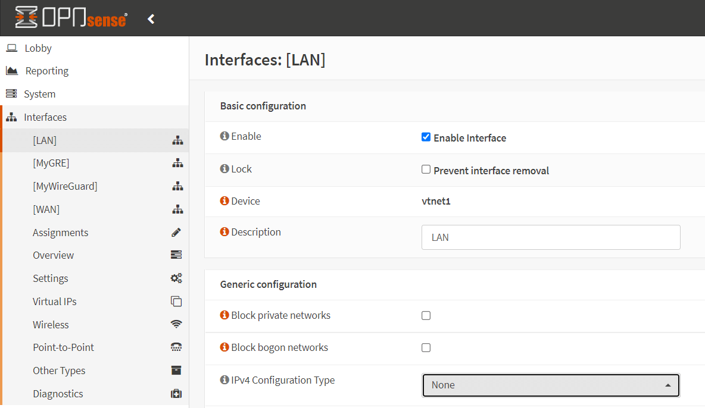

---

## Step 6 — Fix "Block Private Networks"

WAN defaults block private and bogon ranges. That's right when WAN faces the public internet — wrong here, since WAN faces another private network.

**Interfaces → WAN**, uncheck:
- ☐ Block private networks
- ☐ Block bogon networks

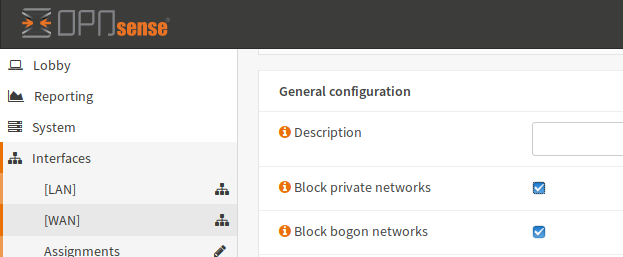

Save and apply. WAN should now show a DHCP lease from the upstream router:

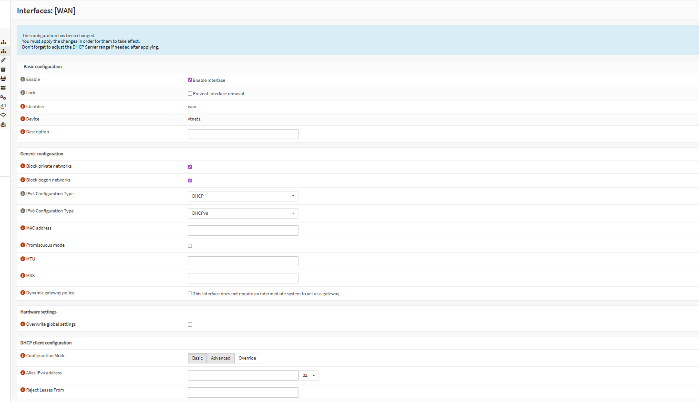

Dashboard view confirming both interfaces are up and routing:

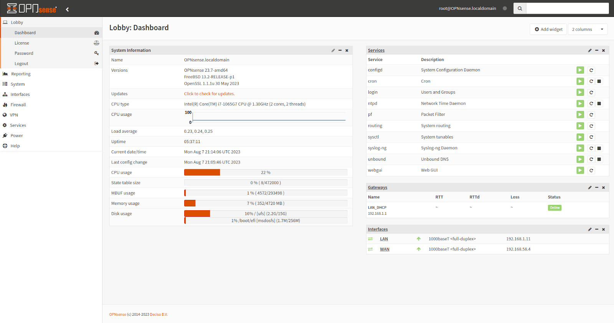

---

## Step 7 — Verify

From OPNsense console option **`8) Shell`**:

```bash
ping -c 3 <router-IP>     # should succeed
ping -c 3 8.8.8.8         # internet
ping -c 3 google.com      # DNS
```

All three pass → routing works.

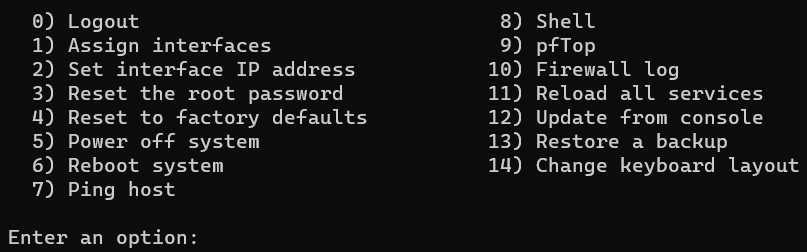

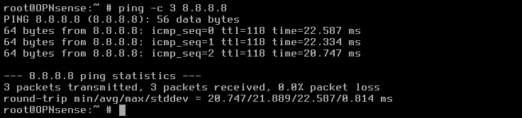

---

## Step 8 — DNS Chain

In a domain environment, the chain has to flow through the DC or AD breaks:

```
Client → DC (DNS) → OPNsense Unbound → Cloudflare 1.1.1.1 (DoT)
```

- **DC:** set DNS forwarders to OPNsense's LAN IP
- **OPNsense (Services → Unbound DNS):** enable, forward to `1.1.1.1` over DoT
- **Clients:** keep DHCP option 006 pointing at the DC

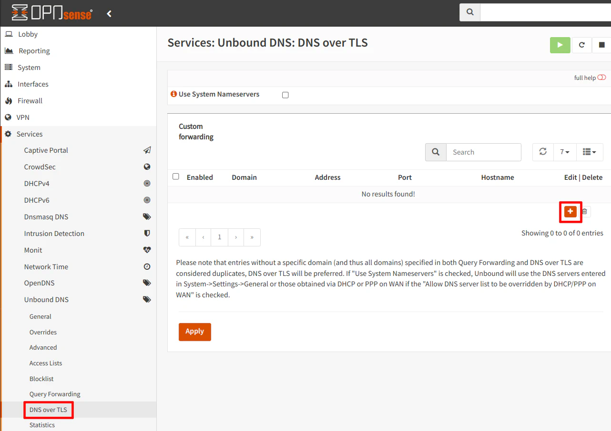

Visual of the full DNS path:


---

## Step 9 — DHCP

Pick one — don't run both:

- **Keep DHCP on the DC** (what I did): disable OPNsense's LAN DHCP under **Services → ISC DHCPv4 → LAN**
- **Migrate to OPNsense:** disable the DC's DHCP role, enable OPNsense DHCP, set option 006 to the DC's IP

---

## Step 10 — Cutover (done)

To move the homelab behind OPNsense:

1. Moved homelab VMs' NICs onto `vmbr0` only
2. Updated their gateway to OPNsense's LAN IP
3. Power-cycled clients to grab fresh leases
4. Verified outbound traffic from homelab VMs hit the router as OPNsense's WAN IP

The router still does Wi-Fi for everything else in the house — that traffic doesn't touch OPNsense, which is fine for a phased rollout.

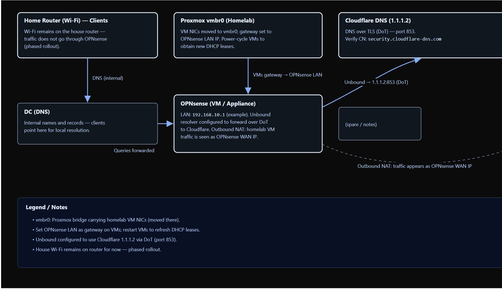

---

## Gotchas I Hit

- **Proxmox VM firewall checkbox enabled** → packets vanish. Disable on every OPNsense NIC.
- **WAN/LAN swapped at install** → can't reach the web UI. Verify with console option 1.
- **"Block private networks" left on** → WAN looks up but passes zero traffic.
- **Both NICs on the same subnet** → asymmetric routing weirdness. Long-term, put LAN on its own subnet.
- **Hyper-V default switch on a Windows VM** → hands out 172.x leases and fights your real DHCP server. Disable it on any Windows VM that doesn't need it.

---

## Next Up

- Unbound blocklists (replaces Pi-hole / AdGuard)
- Suricata IDS in alert-only mode before flipping to IPS
- WireGuard for remote access instead of exposing RDP
- GeoIP block lists on WAN
- VLANs once a managed switch is in place